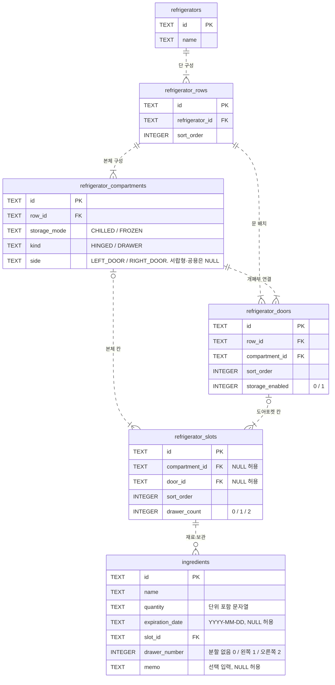

# 냉장고 ERD

```mermaid
erDiagram
    refrigerators ||..|{ refrigerator_rows : "단 구성"
    refrigerator_rows ||..|{ refrigerator_compartments : "본체 구성"
    refrigerator_rows ||..|{ refrigerator_doors : "문 배치"
    refrigerator_compartments ||..|{ refrigerator_doors : "개폐부 연결"
    refrigerator_compartments |o..|{ refrigerator_slots : "본체 칸"
    refrigerator_doors |o..|{ refrigerator_slots : "도어포켓 칸"
    refrigerator_slots ||..o{ ingredients : "재료 보관"

    refrigerators {
        TEXT id PK
        TEXT name
    }

    refrigerator_rows {
        TEXT id PK
        TEXT refrigerator_id FK
        INTEGER sort_order
    }

    refrigerator_compartments {
        TEXT id PK
        TEXT row_id FK
        TEXT storage_mode "CHILLED / FROZEN"
        TEXT kind "HINGED / DRAWER"
        TEXT side "LEFT_DOOR / RIGHT_DOOR. 서랍형·공용은 NULL"
    }

    refrigerator_doors {
        TEXT id PK
        TEXT row_id FK
        TEXT compartment_id FK
        INTEGER sort_order
        INTEGER storage_enabled "0 / 1"
    }

    refrigerator_slots {
        TEXT id PK
        TEXT compartment_id FK "NULL 허용"
        TEXT door_id FK "NULL 허용"
        INTEGER sort_order
        INTEGER drawer_count "0 / 1 / 2"
    }

    ingredients {
        TEXT id PK
        TEXT name
        TEXT quantity "단위 포함 문자열"
        TEXT expiration_date "YYYY-MM-DD, NULL 허용"
        TEXT slot_id FK
        INTEGER drawer_number "분할 없음 0 / 왼쪽 1 / 오른쪽 2"
        TEXT memo "선택 입력, NULL 허용"
    }
```

칸은 본체와 문 중 하나만 참조하며 도어포켓의 `drawer_count`는 `0`이다. 복합 키와 상세 제약은 [DB 테이블 구조](database-schema.md)를 따른다.

재료는 칸과 좌우 번호를 함께 참조한다. 재료가 있는 칸의 삭제·분할 변경과 포켓 숨김은 재료를 이동·삭제한 뒤 허용한다.
